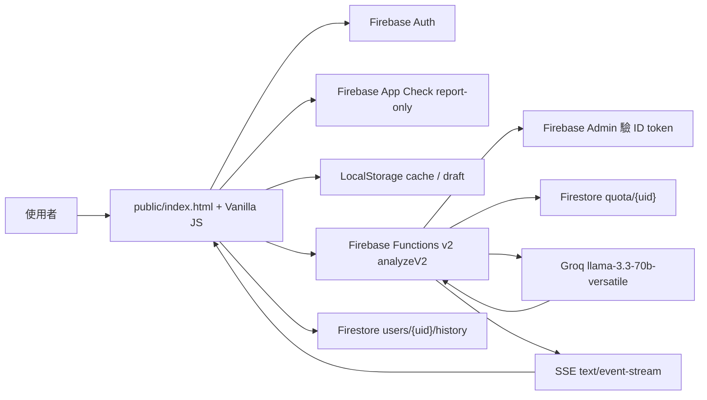
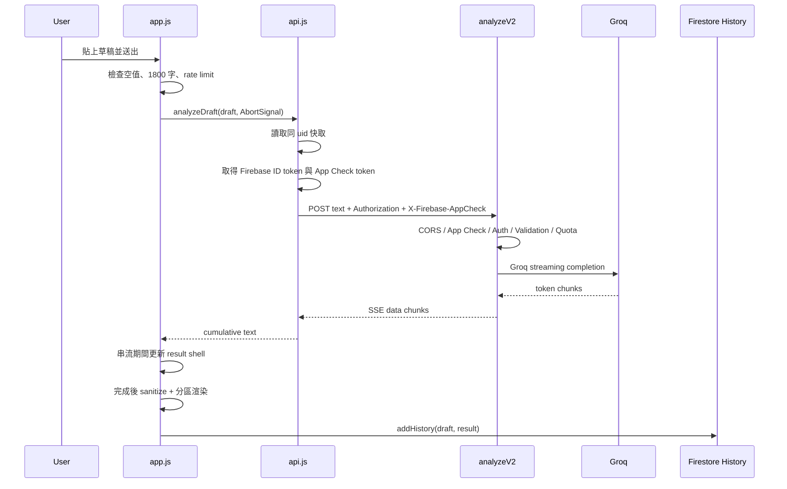

# Fantasy Lore Guardian

西方奇幻小說編修核心。使用者貼上一段草稿後，前端以 Firebase Auth 建立身份，透過 Firebase Functions v2 的 SSE 串流呼叫 Groq，回傳「修改後全文」與「審查摘要」，並依帳號同步草稿歷史。

> 2026-05-26 線上復原註記：正式站與本機 `public/` 已回到 Firebase Hosting release `9ed4d1e801969ed1`（2026-05-25 13:17 TPE）的 Great Sage / WebGL 版本。本 README 是唯一共用 source of truth；`AGENTS.md` 只保留讀取 README 的入口指令，`docs/*` 僅作歷史紀錄。

本文件是專案的架構說明、視覺規格、風險邊界與驗收清單。後續修改請先讀完「最高優先級」與「VFX 時序規格」，再動登入頁、WebGL 或主工具介面。

## 後續 Agent 關鍵規則

- 正式入口是 `public/index.html`，視覺與架構母體是 `public/worldforge-login.html`。
- 修改視覺母體、WebGL 類別、登入儀式、HUD 層、Operational Mode 架構或 RWD 核心規則時，先改正式入口 `public/index.html`，再執行 `npm run sync:login-mother` 同步 `public/worldforge-login.html`；`npm run build` 會透過 `prebuild` 自動同步。只改正式站資料服務、部署 smoke、Firebase 串接或入口專用文案時，可只改 `public/index.html` 並說明原因。
- 不可刪除、替換或降級 `CoreEngine`、`RuneSystem`、`ParticleSystem`、`HUDSystem`、`PostProcessingPipeline`、`LoginController`、`OperationalModeController`。
- 不可為了 HUD 氛圍犧牲主要操作可讀性。草稿、輸出、登入欄位、錯誤訊息、主要按鈕與帳號/歷史操作必須比裝飾 HUD 更清楚、更可點擊。
- 中央「黑曜石法典」保留草稿輸入與唯一分析主按鈕；目前正式文案是「啟動奧術解析引擎」。
- 歷史紀錄、登出、複製卷宗、清空等次要操作只能放在可讀、可點擊的小型 HUD 操作列或卷宗區。
- Operational Mode 是長時間閱讀與編修工作台，不是登入展示頁。字級、行高、輸入框高度、按鈕點擊區和輸出區高度不可低於可用性底線。
- 文件-only 修改至少跑 `git diff --check`；改到前端、Functions、Firebase、CSS、WebGL、登入流程、Operational Mode 或部署相關檔案時，需跑 `npm run check:frontend`、`npm run check:functions`、`npm test`、`npm run build`。部署後再跑 `firebase deploy --only hosting` 與 `npm run smoke:hosting`。

---

## 最高優先級

1. 視覺語言必須是黑暗西幻魔導系統，不是冷藍 cyberpunk、蘋果式 glassmorphism、一般 SaaS 登入頁或行銷 landing page。
2. 登入頁可以電影感很強，主工具頁必須安靜、可讀、可長時間編修。儀式感服務於進入工作台，不可蓋過草稿輸入、分析結果、歷史紀錄與帳號狀態。
3. Firebase Auth 是唯一登入真相。動畫只能在真實 Email / Google / 訪客登入成功後播放 handoff，不可用假帳密、自動成功或固定時間硬切來偽裝驗證。
4. 保留現有 DOM id 與模組契約：`#loginScreen`、`#loginGl`、`#emailAuthForm`、`#loginEmail`、`#loginPassword`、`#loginGoogleBtn`、`#loginGuestBtn`、`#draftInput`、`#checkBtn`、`#result` 等不可任意改名。
5. 不可在 Markdown、程式碼註解、截圖、issue 或 log 中記錄 Groq API key、key prefix、Firebase Admin credential、Secret Manager 輸出或任何真正 server secret。
6. 所有 WebGL / Canvas / Audio loop 必須有 cleanup。離開登入頁、登出、WebGL context lost、reduced motion、visibility hidden、頁面卸載都要停止 CPU / GPU 工作。
7. 強光與 bloom 必須校準。禁止純白閃屏、長時間白屏、刺眼冷藍高亮；淨化閃光應使用羊皮紙金或暗金光霧，並快速回到黑曜石底色。
8. 行動裝置與 `prefers-reduced-motion` 是一級需求，不是事後補丁。手機不得水平溢出，鍵盤不得遮住登入表單，低效能裝置要降低粒子、符文層與後處理。

---

## 專案定位

Fantasy Lore Guardian 是「禁忌魔導書庫 / 西方奇幻小說編修核心」，不是通用 AI 寫作器。它的核心價值是以嚴格西幻總編視角，檢查單段草稿中的語感、角色、文明、情緒與現代人格污染。

目前產品邊界：

- 單次輸入上限：前端與後端皆為 1800 字。
- 分析目標：單段深度審查與文學級重寫，不做長篇分章、不接外部設定書。
- 輸出重點：先完整重寫，再給精簡審查摘要。
- 使用者資料：Firebase Auth 隔離帳號，Firestore 保存歷史，LocalStorage 做草稿與快取輔助。
- 成本策略：Groq 免費 tier 下控制 prompt 與 `max_tokens`，後端配額每日限制訪客 5 次、登入帳號 30 次。

---

## 架構總覽



### Frontend

- `public/index.html`：正式入口。包含 HTML、CSS、Firebase compat SDK、GSAP、Three.js importmap、登入 / 工作台 DOM、主 orchestration inline module。
- `public/worldforge-login.html`：同版視覺母體備份。改登入儀式、WebGL、HUD、Operational Mode 或 RWD 核心時，需以 `npm run sync:login-mother` 或 `npm run build` 的 `prebuild` hook 從 `public/index.html` 同步。
- `public/js/core/`：跨模組設定、狀態與型別，包含 `config.js`、`state.js`、`types.js`。
- `public/js/services/`：外部服務邊界，包含 `analyze-api.js`、`cache.js`。
- `public/js/utils/`：純工具函式，包含 `hud-state.js`、`result-sections.js`。
- `public/js/webgl/`：Three.js / WebGL 視覺模組，包含核心、光學背景、計算環、粒子、字形環、bokeh、材質、數學與 dispose helper。
- `public/forbidden-words.json`：禁詞與語彙掃描資料。
- `public/sw.js`、`public/sw-register.js`、`public/swkill.js`：Service Worker 與清理入口。

### Frontend Placement Rules

- 新增全域設定、常數、AppState 欄位或 JSDoc 型別時，放在 `public/js/core/`。
- 新增 API fetch、快取、timeout、App Check token 讀取等外部服務邏輯時，放在 `public/js/services/`。
- 新增純函式工具時，放在 `public/js/utils/`；不得直接碰 DOM、Firebase 或 AppState。
- 新增或拆分 WebGL 類別時，放在 `public/js/webgl/`，並保留 dispose / reduced motion / visibility cleanup。
- 目前 UI DOM、CSS 與主流程 orchestration 仍在 `public/index.html` / `public/worldforge-login.html` 內。不要把已退役的 `public/js/app.js`、`public/style.css`、`public/worldforge.css`、`public/js/ui/*` 當成現行架構；若重新拆檔，必須同步更新 README、smoke test、CSP / importmap 與兩個 HTML。

### S10 Black Gold SAO UI

- S10 接管版取代舊 codex「黑金 SAO 系統 UI 實作計劃」；不得執行已被推翻的三欄 modal、固定 px 字級、人工 100% 同步 worldforge 方案。
- 登入 modal 採單欄置中 native `<dialog>`，保留 Google-only 登入流程與既有 ARIA / focus-visible / skip-link。
- 字級使用 root rem-based fluid type scale，需維持 WCAG 1.4.4 200% resize text 與 WCAG 1.4.10 320px reflow。
- 黑金 SAO 裝飾限於不遮擋主 CTA、繁中文案、草稿輸入、輸出、歷史與帳號操作；Operational Mode 仍以長時間閱讀與編修可用性為優先。

### Backend

- `functions/src/index.ts`：`analyzeV2` HTTP function。處理 CORS、App Check、Auth、輸入驗證、配額、Groq 串流與 structured logging。
- `functions/src/config.ts`：CORS allowlist 與西幻總編 system prompt。
- `functions/src/validation.ts`：1800 字限制與結構性 prompt injection marker 防護。
- `functions/src/quota.ts`：每日配額 transaction、冪等扣款、Groq 失敗退還。
- `firestore.rules`：只允許 `users/{uid}/history/{id}` owner CRUD，限制固定欄位、id、時間戳、字串長度。

### Runtime Constraints

- 前端是 Vanilla JS ES Modules，無 build step。
- Three.js 由 importmap 指向 `three@0.160.0`，addons 由 `three/addons/` 載入。
- Firebase Web SDK 使用 compat 版本，App Check 目前是 report-only，不強制阻擋。
- Cloud Functions 使用 Node 22、Firebase Functions v2、Secret Manager `GROQ_API_KEY`。
- CSP 不允許任意 inline script；importmap hash 若內容改動，必須同步更新 CSP `sha256`。

---

## VFX 美術規格

### 採用詞彙

後續找參考、命名 class、寫註解或設計提案時，優先使用這些概念：

- Dark Fantasy UI
- Arcane Magic Tech
- Ancient Magical Machinery
- Cinematic Holographic System
- Eldritch / Abyss Aesthetic
- Ritualistic Interface
- Sacred Geometry
- Procedural Rune / Glyph System
- Torus Knot Structures
- Dimensional Seal
- Alchemical Circle / Magic Array
- Particle Vortex / Swarm
- Volumetric Fog / Ember Particles
- Cinematic Bloom
- Chromatic Aberration
- Parallax Tracking
- High Information Density HUD
- Encrypted Data Stream
- Waveform Diagnostics
- System Override Alert

### 避免方向

- 不使用霓虹藍紫 cyberpunk 作為主視覺。
- 不使用白底玻璃卡片或蘋果式透明 UI。
- 不做大 hero landing page，不做品牌介紹頁。
- 不把登入頁擴展成角色創建、捏臉、遊戲開場或不相關世界觀。
- 不用大量單一色相堆滿整頁；主色黑、焦褐、琥珀金，少量深紅警示即可。

### 色彩與曝光

建議主色：

- Obsidian：`#050505`
- Dark Gold：`#b38030`
- Amber：`#ff9900`
- Ember Red：`#ff3300`
- Ash：`#888888`
- Parchment Flash：`#ddccaa`
- Arcane Gold：`#f4d081`

曝光原則：

- Bloom 要有電影級輝光，但長時間穩態不可過曝。
- 同步高潮可短暫拉高 bloom / intensity，但落地後要回到可讀的暗金狀態。
- 白色只允許作為極短的受控高光，不可作為整頁 flashbang。
- Vignette、fog、scanline、grain 可以增加鏡頭感，但不可遮住表單或主工具文字。

---

## 登入 VFX 架構

目前登入 / 工作台 orchestration 在兩個 HTML 的 inline module；基礎 VFX 類別在同一個 inline module，Great Sage / Raphael 強化層拆在 `public/js/webgl/`。後續請沿用，不要把核心特效改回零散或不可 cleanup 的巨型 function。

基礎核心：

- `SceneManager`：建立 renderer / scene / camera，持有生命週期、resize、visibility、context lost、cleanup、warp。
- `CameraController`：滑鼠視差、手機視角、warp 攝影機推進。
- `CoreEngine`：中央魔導核心、torus knot、dimensional seal、lattice、碎片與手稿軌道。
- `RuneSystem`：多層程序化符文環，桌機正常模式目標高密度，手機與 reduced motion 降級。
- `ParticleSystem`：金色粒子、灰燼、vortex / swarm，登入成功時向核心收束。
- `HUDSystem`：WebGL 內的 holographic archive lines 與角落 glyph。
- `PostProcessingPipeline`：EffectComposer、SAO、UnrealBloomPass、Chromatic Aberration、Vignette、Grain。
- `LoginController`、`AnimationTimeline`、`OperationalModeController`：認證 handoff、階段動畫與 Operational Mode 狀態切換。

Great Sage / Raphael 強化層：

- `ArcaneSingularityCore`：中央魔導核心強化、封印層、手稿軌道、脈衝與同步狀態。
- `ArcaneOpticalBackground`：金色光學背景、景深、鏡頭感與背景呼吸。
- `RaphaelComputationRing`：大賢者計算環與系統分析視覺語彙。
- `MagiculeParticleField`：魔素 / 粒子場、登入同步與待命流動。
- `ReferenceGlyphRing`：參考圖感的外圈字形環與符文閱讀層。
- `GoldBokehField`：金色 bokeh、近遠景層次與視覺密度。
- `SteppedAnimationController`：階段式 boot / handoff 時序控制。
- `materials.js`、`constants.js`、`math-utils.js`、`dispose-utils.js`：材質、色票、數學與資源釋放共用層。

性能 profile 規則：

- 桌機：保留高層數 rune、較高 particle count、composer、bloom、SAO。
- 手機：降低 rune layers、particle / dust / fragment count、pixel ratio 與 bloom。
- `prefers-reduced-motion`：大幅降低粒子與 rune，關閉高強度後處理，只保留靜態或低速呼吸感。
- WebGL 不可用：登入功能照常可用，只退回 CSS / HUD 靜態背景。

---

## VFX 時序規格

這是後續校準登入體驗的基準。若實作與此不同，請在 PR / README 註明原因。

### 1. 初始化階段：0s 到 1.0s

視覺狀態：

- 畫面接近全黑，只露出非常低亮度的 fog、灰燼與核心邊緣。
- 粒子以圓球或漩渦外殼隨機漂浮。
- 符文環與核心邊緣只允許約 0.05 到 0.12 的微弱脈動。

目的：

- 讓使用者感到這是一個沉睡的遠古魔導裝置。
- 不急著把所有 HUD 與表單塞滿畫面，先建立深度與重量。

### 2. 儀式介入階段：1.0s 到使用者觸發

觸發：

- 作者認證視窗具象化。

動畫目標：

- Auth window 從中心展開：`scaleY: 0.02`、`scaleX: 0`、`opacity: 0` 到完整尺寸。
- 展開 easing 使用 `power2.out` 接 `back.out(1.2)`，像系統視窗從虛擬空間拉出。
- 視窗可有輕微 3D tilt / parallax，但不得影響輸入穩定性。

互動回饋：

- input focus、button hover、表單 mode 切換可短暫提高核心能量。
- 建議將 bloom strength 從穩態提高到約 1.2 到 1.8 的短脈衝，再回穩。
- 錯誤狀態使用 ember red，短促抖動即可，不播放完整 warp。

### 3. 突變與同步階段：登入成功後 0s 到 3.8s

這是整個登入頁的高潮。它只能在真實 Auth 成功後播放。

| 時間 | 特效 | 目標參數 | Easing |
| --- | --- | --- | --- |
| 0s 到 0.2s | 彈窗過渡 | Auth UI 模糊、淡出、鎖定操作；同步狀態展開 | `power2.out` |
| 0s 到 1.5s | 核心能量衝擊 | Bloom strength 最高約 4.5，core intensity 最高約 3.5 | `expo.in` |
| 0s 到 1.5s | 符文環加速 | ring speed 最高到 base speed 30x | `power3.in` |
| 1.8s 到 3.5s | 淨化閃光 | 背景短暫轉 `#ddccaa` 後回黑曜石 | `power2.out` |
| 1.8s 到 3.8s | 狀態轉換 | Core / Rune state 從 ember 轉 arcane gold | `power2.out` |

注意：

- 不使用純白硬切。
- 強光後必須讓攝影機、粒子、文字與 UI 一起落回可讀狀態。
- 若使用 GSAP timeline，所有 tween 必須可被 cleanup kill。

### 4. 編修待命模式：3.8s 之後

穩態視覺：

- 粒子色轉為柔和金色。
- 符文環轉速降到約 1.5x，代表核心穩定運轉。
- Bloom 回到約 0.8 到 1.2 的可讀範圍。
- 中央或底部狀態可揭露 `EDITORIAL MODE ONLINE`、`REVISION ENGINE READY` 或繁中等價文案。

文字解碼：

- 可使用 `decryptText(element, finalString)` 類型的字元替換效果。
- 字元池應是符號與 ASCII，逐幀替換為最終文字。
- 長度建議為 `finalString.length * 3` 幀左右，避免拖太久。

---

## 登入 UI 規格

登入頁採「魔導認證面板」而非普通帳密卡。

必留路徑：

- Email / Password 登入。
- Email / Password 註冊。
- Google 登入。
- 訪客登入。

布局原則：

- Email / Password 是主要儀式入口，保留在中央或核心附近。
- Google 與訪客是次要入口，可放在 `EXTERNAL SEALS` 或旁側 HUD 模組。
- 表單文案可使用「作者印記」、「奧術密鑰」、「開啟編修儀式」，但錯誤訊息仍要清楚可理解。
- 登入按鈕、欄位、mode tabs 必須 keyboard 可用，focus state 明確。
- 失敗不播放 warp，只在登入面板內顯示低亮度紅琥珀錯誤。
- 使用者取消 Google popup 不顯示嚴重錯誤，回到待機狀態。

保留但收斂：

- 可以借鑑 SAO 式「視窗具象化、系統警告、同步儀式」的節奏。
- 不使用原作名詞、角色名、作品標語或角色創建流程。
- 本專案語義必須始終是「作者進入編修核心」，不是「玩家登入遊戲世界」。

---

## 主工具 UI 規格

主工具頁是長時間閱讀與編修的工作台。

必須清楚：

- 草稿輸入槽。
- 字數限制與禁詞提示。
- 分析按鈕、清空手稿、專注模式。
- 分析進度。
- 修改後全文。
- 審查摘要。
- 分區複製與完整複製。
- 歷史紀錄與目前選中項。
- 帳號狀態與登出。

視覺規則：

- 背景可保留黑金魔導氛圍，但內容區不能被粒子、掃描線或裝飾遮住。
- 結果文字要比 HUD 裝飾優先。
- 手機版側邊 HUD 可自動隱藏，主內容單欄優先。
- 不做 landing page。使用者登入後直接進入可操作的編修工作台。

---

## 分析流程



錯誤處理原則：

- 新分析會 abort 前一筆分析。
- 前端 UX timeout 為 180 秒。
- 後端 HTTP 錯誤統一 `{ code, message }`，前端相容舊 `{ error }`。
- Groq 建連失敗時退還 quota。
- SSE 中途錯誤會送 `data: { error }`，前端應中斷並顯示可讀錯誤。

---

## 資料與安全

### Auth

- Firebase Auth 支援 Email / Password、Google popup、匿名訪客。
- 手機 Chrome 的 redirect 狀態問題目前以 popup-only 規避。
- `authDomain` 使用同源 `.web.app`，降低第三方儲存分割問題。

### App Check

- 前端會嘗試取得 reCAPTCHA Enterprise token，並以 `X-Firebase-AppCheck` 傳給後端。
- 後端目前 `ENFORCE_APP_CHECK = false`，只記錄 `missing`、`valid`、`invalid`。
- 切強制模式前必須在正式網域以 Email、Google、訪客各送短草稿，確認 Functions log 皆為 `appCheckStatus: 'valid'`。

### Firestore

- 歷史路徑：`users/{uid}/history/{historyId}`。
- 每筆歷史包含 `id`、`ts`、`draft`、`result`、`preview`。
- Rules 限制 owner-only、固定欄位、id 格式、時間戳、字串長度。
- 配額文件在後端以 Admin SDK 寫入，前端不可直接信任配額狀態。

### Secret Hygiene

- Groq key 只能放在 Firebase Secret Manager。
- `public/js/core/config.js` 裡的 Firebase web config、Function URL、reCAPTCHA site key 是 public runtime config，不是 server secret。
- 不要把 Secret Manager 指令輸出、key prefix、輪替紀錄寫入 README。

---

## 後續實作規劃

### Phase 1：登入 VFX 校準

- 在 `loginfx.js` 明確分出 `idle`、`authInteracting`、`syncing`、`operational` 狀態。
- 將 bloom、core intensity、rune speed、particle vortex、camera push 統一交給 timeline 控制。
- 補上受控 parchment flash，不使用白屏。
- 讓 input focus / button hover 能推高短暫 energy，但不破壞 accessibility。
- 完成 `EDITORIAL MODE ONLINE` 或等價文案的 decrypt reveal。

### Phase 2：認證視窗精修

- 保留現有 Firebase Auth id 與 handler。
- 讓中央登入面板更接近 dark fantasy system override window。
- 收斂過多大型 HUD，讓表單與主要 CTA 保持視覺中心。
- 錯誤、取消、重試狀態都要有低亮度紅琥珀回饋。

### Phase 3：主工具降噪

- 主工具保持黑金世界觀，但降低背景干擾。
- 結果區優先可讀性，避免 HUD 壓過重寫全文。
- 手機單欄檢查：textarea、歷史下拉、結果操作按鈕不可擠壓。

### Phase 4：可觀測與測試

- 保留 `window.__FLG_LOGIN_FX_METRICS__`，供瀏覽器驗證 rune layers、particle count、SAO、disposed 狀態。
- 對桌機 `1366x768` 與手機 `390x844` 做瀏覽器截圖驗證。
- 檢查 WebGL cleanup：登入成功 handoff 後 canvas hidden 再 dispose，避免白格。
- 確認 `npm.cmd run check`、`npm.cmd test`、`npm.cmd run smoke:hosting` 通過。

---

## 開發命令

常用檢查：

```powershell
npm.cmd run check
npm.cmd test
npm.cmd run test:rules
npm.cmd run smoke:hosting
npm.cmd run build:functions
npm.cmd run audit:functions
```

本機 C 槽空間不足時，於 PowerShell 同一段設定 F 槽 cache / tmp：

```powershell
$env:npm_config_cache="F:\瀏覽器下載\小說網站\.npm-cache"
$env:TEMP="F:\瀏覽器下載\小說網站\.tmp"
$env:TMP="F:\瀏覽器下載\小說網站\.tmp"
$env:FUNCTIONS_DISCOVERY_TIMEOUT="120"
Set-Location "F:\瀏覽器下載\小說網站"
```

部署 Hosting：

```powershell
firebase deploy --only hosting --project project-7276420283723642146
```

部署 Functions：

```powershell
firebase deploy --only functions --project project-7276420283723642146
```

查 Functions log：

```powershell
firebase functions:log --only analyzeV2 -n 80
```

---

## 驗證清單

### 改登入頁或 VFX 後

- 桌機 `1366x768`：登入視窗置中，無水平溢出，WebGL 背景非空白。
- 手機 `390x844`：登入頁可垂直捲動，鍵盤不遮住必要欄位，無水平溢出。
- `prefers-reduced-motion`：不播放長 warp，不使用高強度 bloom。
- WebGL 不可用：Email / Google / 訪客登入仍可操作。
- 登入成功：只有本次使用者操作後播放 handoff，重新整理已登入狀態直接進主工具。
- 登出後：登入畫面重新出現，舊 canvas / renderer 已 cleanup。
- Google popup 取消：不播放 warp，不顯示嚴重錯誤。

### 改 Auth / App Check / API 後

- Email 註冊成功，導覽列顯示 displayName 或 email 前綴。
- Email 登入成功。
- Google 登入成功。
- 訪客登入成功。
- 登出後結果面板不殘留上一個帳號的分析內容，密碼欄位清空。
- 未登入 POST `analyzeV2` 回 `401 { code, message }`，不碰 Groq。
- 正式網域 App Check token 在 Functions log 顯示 `valid`。

### 改分析與結果後

- 空草稿不能送出。
- 超過 1800 字顯示前端錯誤。
- Ctrl / Cmd + Enter 可送出。
- SSE 首字輸出後 result shell 不重複重建。
- 完成後分成「修改後全文」與「審查摘要」。
- 完整複製、分區複製、重新審閱、回到手稿可用。
- 歷史紀錄新增、載入、單筆刪除、批次刪除正常。

---

## Accessibility

### a11y baseline 2026-05-26

- S9 自動化 baseline 已新增 `npm.cmd run test:a11y`，以 Playwright + axe 掃描登入頁、工作區、歷史抽屜開啟三種狀態。
- axe critical / serious violations：0。
- axe moderate / minor：每個狀態各 1 個 moderate，皆為 `meta-viewport`。原因是目前 viewport 仍含 `maximum-scale=1.0`；這是 S10 Part A 的指定修正，不在 S9 先行搬動。
- visual baseline 已新增 `npm.cmd run test:visual`，涵蓋登入頁 1366、登入頁 390、工作區 1366、歷史抽屜 1366、帳號選單 1366；5 張 snapshot 已建立並逐張確認 cyan 只保留在 status / sync 語意附近。
- 真機 SR 測試（NVDA / VoiceOver / TalkBack）：尚未執行，列入後續專項。

### Contrast Baseline

以下以 CSS 宣告色混合到主要深色背景後估算，門檻為 WCAG AA 一般文字 4.5:1。

| 場景 | 文字色 / 背景 | 對比 | 結論 |
|---|---|---:|---|
| `.hud-code` | `rgba(200,216,232,0.72)` / `#050505` | 7.37:1 | 通過 |
| input / textarea placeholder | `rgba(170,195,215,0.78)` / 深黑輸入底 | 7.01:1 | 通過 |
| `.auth-panel .seal-strip` | `rgba(214,166,77,0.78)` / `#050505` | 5.78:1 | 已由 0.62 alpha 調整後通過 |
| `.dossier-action` | ghost button 實際文字 `rgba(200,216,232,0.88)` / 黑底 | 11.09:1 | 通過 |
| `.history-time` | `rgba(255,226,160,0.58)` / 黑底 | 5.67:1 | 通過 |
| `.account-meta small` | `rgba(241,222,194,0.58)` / 黑底 | 5.48:1 | 通過 |
| `.spell-warn` | `rgba(255,226,160,0.62)` / `#050505` | 6.36:1 | 通過 |
| `.draft-field-help` | `rgba(232,216,184,0.58)` / 深黑面板底 | 5.18:1 | 通過 |
| `.notice` toast | `rgba(255,226,160,0.86)` / 黑底 | 12.13:1 | 通過 |
| `.workbench-nav-title span` | `rgba(200,216,232,0.62)` / `rgba(4,14,28)` | 5.58:1 | 通過 |

### Keyboard Walkthrough

- 桌機 1366 與手機 390 皆完成 Playwright walkthrough。
- 登入狀態 Tab flow：skip-link 顯現，接著到 Google 登入 CTA；沒有落入 `aria-hidden` 或 `[hidden]` 元素。
- 工作區 Tab flow：skip-link → 歷史紀錄 → 帳號選單 → 草稿輸入 → 分析按鈕 → 複製全部 → 清空手稿。
- 發現並修補：作者 CSS 可能覆蓋 HTML `hidden` 預設，導致 hidden 的 `#reanalyzeButton` 可被聚焦；已新增全域 `[hidden] { display: none !important; }`，並同步 `public/index.html` / `public/worldforge-login.html`。
- ESC / Ctrl+Enter / menu close 屬 runtime 行為，保留現有 controller 與事件 handler；S9 baseline 未改 Auth 或分析流程。

---

## 主要檔案索引

- 前端入口：`public/index.html`
- 視覺母體備份：`public/worldforge-login.html`
- 主流程 / DOM / CSS / 登入與工作台 orchestration：`public/index.html` inline module
- 核心設定 / 狀態 / 型別：`public/js/core/`
- API 串流：`public/js/services/analyze-api.js`
- 分析快取 / Firestore timeout helper：`public/js/services/cache.js`
- HUD 狀態工具：`public/js/utils/hud-state.js`
- 結果解析與 Markdown lite render：`public/js/utils/result-sections.js`
- WebGL 視覺模組：`public/js/webgl/`
- 禁詞資料：`public/forbidden-words.json`
- Service Worker：`public/sw.js`、`public/sw-register.js`、`public/swkill.js`
- Cloud Function：`functions/src/index.ts`
- System prompt / CORS：`functions/src/config.ts`
- 輸入驗證：`functions/src/validation.ts`
- 配額：`functions/src/quota.ts`
- Firestore rules：`firestore.rules`
- Hosting / emulator 設定：`firebase.json`
- Hosting smoke：`scripts/smoke-hosting.mjs`
- 測試：`tests/*.test.mjs`

---

## 線上復原與文件校準紀錄（2026-05-26）

- 正式站與本機 `public/` 已回到 Firebase Hosting release `9ed4d1e801969ed1`（2026-05-25 13:17 TPE）的 Great Sage / WebGL 版本。
- `public/index.html` 與 `public/worldforge-login.html` 目前是同版大型單檔入口；檔案內容包含 `GREAT SAGE MANUSCRIPT SYSTEM` 與 `tool-stack`，且不包含錯誤重構版的假核心登入 DOM。
- README 已改回唯一共用 source of truth；`AGENTS.md` 只保留讀 README 的入口指令，`docs/*` 只作歷史快照。
- 已退役的 `public/js/app.js`、`public/style.css`、`public/worldforge.css`、`public/js/ui/*` 不再是現行架構。後續若要重新拆檔，需先在本 README 更新設計與驗收清單，再動程式。

### 下次復原方式

本次復原點會保存在 Git tag `restore/great-sage-online-20260526`，並在 `restore-points/great-sage-online-20260526.json` 留下 machine-readable manifest。

優先復原方式：

```powershell
git restore --source restore/great-sage-online-20260526 -- public README.md AGENTS.md docs scripts/smoke-hosting.mjs tests/result-parser.test.mjs restore-points/great-sage-online-20260526.json
git diff --check
npm run check
npm test
npm run smoke:hosting
```

若 Git 內容再次被錯誤覆寫，先用 `git show restore/great-sage-online-20260526:restore-points/great-sage-online-20260526.json` 確認版本指紋，再恢復上述檔案。若本機 Git ref 遺失，從 Firebase Hosting release history 找 `sites/project-7276420283723642146/versions/9ed4d1e801969ed1`；復原後需確認首頁同時符合：

- 包含 `GREAT SAGE MANUSCRIPT SYSTEM`。
- 包含 `class="tool-stack left"`。
- 不包含 `class="auth-core"`。
- `public/index.html` 與 `public/worldforge-login.html` 內容一致。

---

## 維護原則

- 先保護安全、成本與資料隔離，再做視覺升級。
- 視覺升級以現有 `Worldforge` 架構為基礎，不另起一套互相打架的登入頁。
- UI 文案要符合「西方奇幻小說編修核心」，但 loading 與錯誤狀態不可宣稱不存在的功能。
- IME composing 期間不可觸發昂貴分析、禁詞掃描或干擾性自動保存。
- 所有長時間 async request 必須有 timeout、取消、finally 狀態復原與可辨識錯誤。
- Functions 與 Hosting 可分開部署，避免 UI 與後端契約同時失配。
- 沒有 GitHub remote 時，不把 GitHub Actions 當必要流程；本機檢查與 Firebase 手動部署是目前主流程。

---

## 本輪清理與驗證紀錄（2026-05-21）

### 清理死碼
- 移除已退役的登入 boot 流程：刪除 `public/js/ui/loginboot.js`，同步清除 `public/index.html` 的 `#loginBoot` DOM、`public/style.css` 與 `public/worldforge.css` 的 boot terminal / veil / shard 樣式。
- 移除未使用狀態與相容輸出：`AppState.introPlayed`、`AppState.subscribe()`、`CONFIG` 舊匯出，以及 `loginfx.js` 內未使用的 easing helper。
- 保留未能確認用途的靜態資產；未刪除疑似設計參考圖，避免誤傷。

### 邏輯修正
- `auth.js` 改由登入背景完成後直接標記 `boot-complete`，保留現有登入轉場與訪客 / Email / Google 入口。
- `firestore.js` 改讀 `UI_CONFIG.STORAGE_KEY`，移除舊 `CONFIG` 依賴。
- `functions/src/config.ts` 補上 `http://127.0.0.1:5000` 與 `http://127.0.0.1:3000`，讓 Firebase Hosting emulator 的 127.0.0.1 URL 不被 CORS 擋下。
- `worldforge.css` 修正 `.archive-fog` 造成的手機登入畫面水平溢出。
- 登入頁重新整理時新增 `body.auth-resolving` 初始閘門：Firebase Auth 判定完成前先隱藏主功能頁，避免未登入狀態短暫閃到主頁再回登入頁。

### 架構整理
- 新增 `public/js/core/`：集中 `config.js`、`dom.js`、`state.js`、`types.js`。
- 新增 `public/js/services/`：集中 `analyze-api.js`、`cache.js`、`history-sync.js`，讓 API、快取、Firestore 同步不再混在 UI 目錄。
- 新增 `public/js/utils/`：集中純工具函式 `text.js`。
- UI 模組改成更明確的檔名：`result-view.js`、`history-panel.js`、`draft-editor.js`、`spell-scan.js`、`dropdown-menu.js`、`clock-hud.js`、`toast-center.js`。
- 同步更新 `public/index.html` modulepreload、`app.js` orchestration imports、Auth / History / Result / Draft / Services 之間的相對引用，以及 `tests/sse.test.mjs`、`scripts/smoke-hosting.mjs`。
- 第二輪解耦 `services/history-sync.js` 與 `ui/history-panel.js`：資料服務只負責 session / Firestore 讀寫與回傳結果，歷史 UI 負責 sync 狀態、toast、render，移除 services 反向 import UI 的循環依賴。
- 第三輪拆出 `public/js/ui/user-menu.js`：帳號觸發器、頭像 fallback、登入 / 登出面板渲染集中在 UI 模組；`auth.js` 保留 Firebase Auth、App Check、登入頁顯示與狀態 handoff。

### 驗證結果
- 已執行：`npm.cmd run check`、`npm.cmd test`、`npm.cmd run test:rules`、`npm.cmd run smoke:hosting`、`npm.cmd run build:functions`。
- 已執行：`npm.cmd run audit:functions`；目前回報 9 個 low severity transitive vulnerabilities，`npm audit fix --force` 會牽動破壞性依賴變更，未自動套用。
- 使用 Firebase Hosting emulator 實測 `http://127.0.0.1:5000/`：登入 / 登出、訪客登入、重新整理、上一頁返回、404 返回、空送出錯誤提示、草稿字數、術語提示、專注模式、歷史空狀態、API 失敗提示、手機版水平溢出。
- 已部署：`firebase deploy --only functions,hosting --project project-7276420283723642146`，Hosting live release 完成，`analyzeV2` 更新至 revision `analyzev2-00023-qef`。
- 部署時需設定 `FUNCTIONS_DISCOVERY_TIMEOUT=120`；未設定時 Firebase Functions discovery 會在 10 秒超時。
- 部署後已執行 production smoke，並確認正式站 `https://project-7276420283723642146.web.app/` 可載入、沒有舊 `loginBoot/loginboot` 引用、無水平溢出。
- 已確認 127.0.0.1 CORS preflight：`Origin: http://127.0.0.1:5000` 回 `204`，`Access-Control-Allow-Origin` 正確回傳同 origin。
- 已部署 Hosting reload 修正，線上 HTML 確認 `body.auth-resolving`、`app.js?v=40`、`auth.js?v=40`、`worldforge.css?v=15` 生效；正式站未登入 reload 後停留登入頁，無水平溢出。
- 已部署 Hosting 架構整理版，線上 HTML 確認 `app.js?v=42`、`public/js/core/`、`public/js/services/` 與新 UI 檔名已生效，舊 `js/api.js`、`ui/firestore.js` 不再被首頁引用。
- 本機瀏覽器實測：未登入 reload、訪客登入、草稿輸入、術語提示、專注模式、SSE 分析完成、按鈕狀態復原、無 console error、無水平溢出。
- 已部署第二輪 Hosting，線上 HTML 確認 `app.js?v=43`、`auth.js?v=43`、`services/history-sync.js` 與新 UI 模組仍正確引用。
- 第二輪本機瀏覽器實測：訪客狀態下分析既有草稿，歷史徽章增加、歷史面板出現新紀錄、同步狀態顯示「草稿記憶已同步」、按鈕狀態復原、無 console error。
- 已部署第三輪 Hosting，線上 smoke 確認 `app.js?v=44`、`auth.js?v=44`、`ui/user-menu.js` preload 與現有 App Check / result parser / function unauthorized contract 正常。
- 第三輪本機瀏覽器實測：登入狀態帳號選單可開啟，登出後 reload 停在登入頁，訪客登入回主功能頁，帳號面板由 `user-menu.js` 顯示「訪客 / 訪客模式 / 登出」。
- 第四輪收斂 git 檔案狀態：舊 `public/js/*.js` 與舊 `public/js/ui/{draft,dropdown,firestore,history,hud,result,spell,toast}.js` 已確認無正式引用，對應新位置在 `core/`、`services/`、`utils/` 與新 UI 檔名；`public/worldforge-login.html` 目前未被首頁引用，保留為待確認 prototype，不刪除。
- 第四輪 CSS 死碼掃描：移除 `style.css` 內舊 `INTRO OVERLAY — PSYCHO-PASS HUD` 與其 HUD panel / z-index helper 區塊，約 1110 行；重新掃描後 `style.css` / `worldforge.css` 未引用 class 數量為 0。`worldforge.css` 保留未使用的 `--wf-*` palette token 作為設計語彙，不列入功能死碼刪除。
- `http://localhost:5000/` 在此環境曾出現 Firebase Auth `auth/network-request-failed`，`127.0.0.1:5000` 可正常訪客登入；建議正式 QA 時再核對 Firebase Auth 網域設定。

---

## 授權與宣告

作者：Fantasy Lore Guardian Team

All rights reserved.
