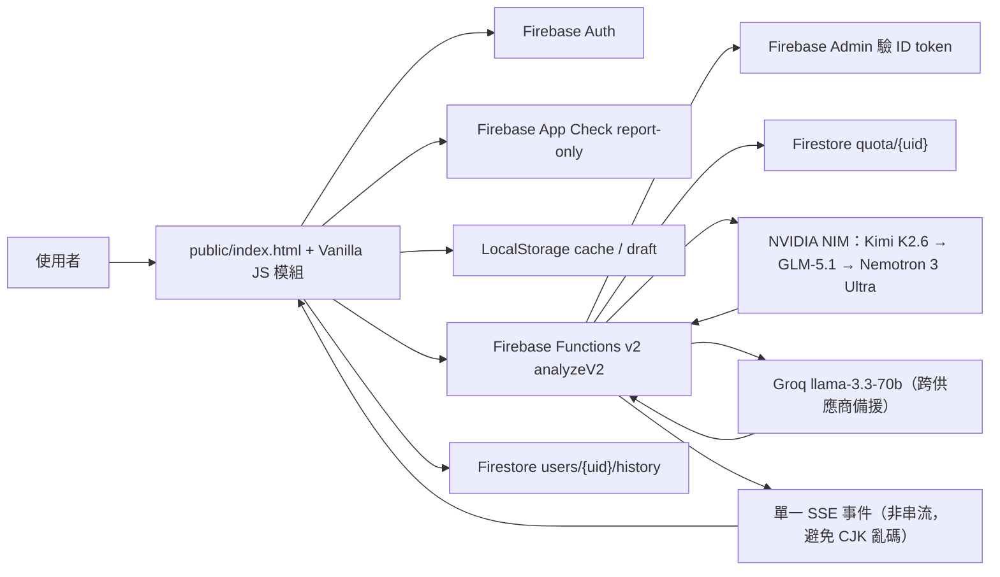
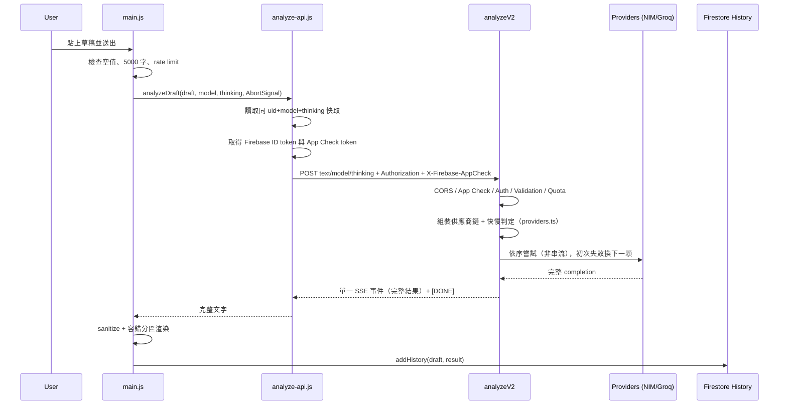

# Fantasy Lore Guardian / 大賢者鑑定系統

西方奇幻小說編修核心。使用者貼上一段草稿後，前端以 Firebase Auth 建立身份，透過 Firebase Functions v2 呼叫 LLM 供應商鏈（NVIDIA NIM 多模型 + Groq 跨供應商備援；非串流、以單一 SSE 事件回傳），得到「修改後全文」與「審查摘要」，並依帳號同步草稿歷史。可手動選模型（自動／Kimi／Groq）與思考模式（深度／快速）。

> **2026-06-07 架構重做（source of truth 切換）**
> 本 README 已重寫，描述的是 **`rebuild/aaa-2026` 分支的模組化新架構**（lean 語意化 `index.html` + 外部模組 + `public/css/*` 設計系統 + `public/js/effects/*` 特效層），這是現行**正式入口**與唯一 source of truth。
> 舊單體 `worldforge-login.html`（5693 行）與其 importmap / `PostProcessingPipeline` / `#ritualStack` 等 id 契約已**退役**，並已**移出專案**（備份於 `F:\_flg-legacy\`，git 歷史仍在）。舊 `docs/*` 單體時代執行紀錄同樣移出。舊 README 的視覺/架構規則（母體 sync、手機/reduced-motion 強制降級、不可降級單體類別、單體 DOM 契約）已**作廢**。
> 安全、成本、資料契約等保護性鐵律**不變**，照舊遵守。

---

## 後續 Agent 關鍵規則

- 正式入口是 **`public/index.html`**（lean 語意化 shell，183 行）。UI/CSS 在 `public/css/*`，邏輯與特效在 `public/js/*`。
- Legacy 單體母體 `worldforge-login.html` **已移出專案**（備份於 `F:\_flg-legacy\`，git 歷史仍在）；不要重新引入、同步，也不要把它當架構參考。`npm run build` 已移除 `prebuild`/`sync:login-mother`，不再生成它。
- **保護性鐵律不可違反**（與視覺無關，永遠優先）：
  1. 不在程式碼、註解、log、issue、README 記錄 Groq API key / key prefix / Firebase Admin credential / Secret Manager 輸出 / 任何 server secret。
  2. 不改 Firebase / Auth / API / Firestore 資料契約、分析 SSE 流程、配額邏輯、`firestore.rules`，除非任務明確要求。
  3. 所有 WebGL / Canvas / Audio loop 必須有 cleanup：離開登入頁、登出、context lost、visibility hidden、頁面卸載都要停止 CPU / GPU 工作並 dispose。
  4. **永久免費 tier only**：主力 NVIDIA NIM（Kimi K2.6 / GLM-5.1 / Nemotron 3 Ultra，免費 endpoint）+ Groq 免費備援；控制 prompt 與 `max_tokens`，維持後端每日配額（訪客 5、帳號 30）。不升級任何付費 tier、不還原多版本知識庫。NIM key（`nvapi-`）只放 Secret Manager。
- 不可為了 HUD / 特效氛圍犧牲主工具頁可讀性：草稿、輸出、登入欄位、錯誤訊息、主按鈕、帳號/歷史操作必須比裝飾更清楚、更可點擊。
- 改 WebGL / 特效 / CSS / 登入流程 / 前端時，跑 `npm run check:frontend`、`npm test`，必要時 `npm run build`；部署後 `firebase deploy --only hosting` 與 `npm run smoke:hosting`。文件-only 至少 `git diff --check`。
- 前端無 build step（vanilla ES Modules）。Three.js 與其 addon 走 **jsdelivr full-URL / `/+esm`**（已在 CSP `script-src` 白名單），**不使用 importmap、不需改 CSP hash**。

---

## 最高優先級

1. **安全與資料隔離優先**：Secret hygiene、Auth 為唯一登入真相、Firestore owner-only、配額由後端決定，前端不可偽造。
2. **成本控制**：永久免費 tier（NIM 多模型 + Groq 備援），prompt + `max_tokens` 受控，後端每日配額硬限制。
3. 視覺語言是 **黑暗西幻魔導 + 黑金魔法書**，不是冷藍 cyberpunk、蘋果式 glassmorphism、SaaS 登入頁或行銷 landing page。
4. 登入頁可以電影感極強；主工具頁背景可保留黑金氛圍，但**內容區可讀性永遠優先**，特效只在背景層、不蓋表單/結果/操作。
5. Firebase Auth 是唯一登入真相。正式入口只保留 Google popup；handoff 動畫只能在真實 Google 登入成功後播放，不可用假帳密/自動成功/固定時間硬切偽裝驗證。
6. 保留現行 DOM id 契約（見「DOM 契約」節），app 邏輯依賴它們綁定。
7. 強光與 bloom 必須校準：禁純白閃屏、長白屏、刺眼冷藍高亮；淨化閃光用羊皮紙金 / 暗金光霧，快速回到黑曜石底色。
8. 視覺層失敗安全：WebGL 不可用 / context lost → 自動退回 CSS 電影級背景（已就緒），功能不受影響、永不黑屏。

---

## 專案定位

Fantasy Lore Guardian 是「禁忌魔導書庫 / 西方奇幻小說編修核心」，不是通用 AI 寫作器。核心價值是以嚴格西幻總編視角，檢查單段草稿中的語感、角色、文明、情緒與現代人格污染。

產品邊界：

- 單次輸入上限：前端與後端皆 5,000 字（NIM 大 context；Groq 備援依 TPM 動態壓 `max_tokens`，容不下則跳過）。
- 分析目標：單段深度審查與文學級重寫，不做長篇分章、不接外部設定書。
- 輸出：先完整重寫，再給精簡審查摘要。
- 雙模式：≤600 字或手動關 thinking 走快速（~20-40s）；較長走深度（thinking 開，~1-3 分）。
- 使用者資料：Firebase Auth 隔離帳號，Firestore 保存歷史，LocalStorage 做草稿與快取輔助。
- 成本：永久免費 tier（NIM 多模型 + Groq 備援），後端配額每日訪客 5 次、登入帳號 30 次。

---

## 架構總覽



### Frontend 檔案架構（rebuild/aaa-2026）

```
public/
  index.html            正式入口：語意化 App Shell + critical inline CSS（極小）
  css/
    tokens.css          設計系統：黑金色票 / 間距 / 字級 / 分層 z 變數
    app.css             版面骨架、元件（按鈕/面板/表單/彈窗/抽屜/toast）、工作區 RWD
    motion.css          keyframes + reduced-motion 變體
  js/
    main.js             進入點 / 總接線：啟動 shell、綁定、分析/結果/歷史/草稿編排、延後特效
    app/
      auth.js           Firebase 初始化 + Google 登入/登出（行為不變）
      ui.js             彈窗/抽屜/toast/狀態/遮罩（分層正確、transform/opacity）
      review-controls.js MODEL CORE SLOT 模型槽（自/深/快）+ 思考開關，寫入 AppState 供 analyze-api 帶入
    core/               config.js（設定）、state.js（AppState）、types.js
    services/           analyze-api.js（呼叫 Cloud Function + SSE）、cache.js（per-uid 快取）
    utils/              result-sections.js（拆段 + markdown-lite + 容錯標題解析）
    effects/
      effects-manager.js  WebGL lazy 初始化 + context-lost→CSS fallback + 生命週期總控
      great-sage-core.js  引擎殼：契約/addon 載入/自適應 render scale/站內事件→相位映射
      sage-vfx.js         SAGE CORE IGNITION 視覺真源（零依賴工廠；poc/vfx-lab.html 共用）
      interactions.js     按鈕 ripple / 磁吸微互動
      link-start.js       LINK START 登入→工作區轉場
  forbidden-words.json  禁詞與語彙掃描資料
  sw.js / swkill.js     Service Worker 安全墊與清理入口
```

> 舊版 `js/webgl/` 強模組、`sw-register.js`、`spellcheck.worker.js` 已於 2026-06-12
> 確認零引用並封存至根目錄 `deadcode/`（不部署；詳見 `deadcode/README.md`）。
> 原「Phase 2 接回 webgl/*」計畫由 SAGE CORE IGNITION 引擎整體取代，不再執行。

### Frontend 放置規則

- 全域設定 / 常數 / AppState / 型別 → `js/core/`。
- API fetch / 快取 / timeout / App Check token → `js/services/`。
- 純函式工具（不碰 DOM/Firebase/AppState）→ `js/utils/`。
- App 控制（auth / UI 控制器）→ `js/app/`；主編排在 `js/main.js`。
- WebGL / 特效類別 → `js/effects/`，必須保留 dispose / context-lost / visibility cleanup。
- UI DOM 與主流程在 `public/index.html` + `js/main.js`；CSS 在 `public/css/*`。**不要**把功能邏輯塞進特效檔，不要 `!important` 海、inline style 海、z-index 地獄。

### DOM 契約（app 邏輯依賴，不可任意改名）

- 登入：`#authScreen`、`#googleLoginBtn`、`#authStatus`。
- 背景：`#bgStage`、`#sageCanvas`（WebGL canvas）、`.bg-aura/.bg-grid/.bg-vignette`（CSS fallback 層）。
- 導航：`#historyToggleBtn`、`#logoutBtn`。
- 歷史：`#historyPanel`、`#historyClearAllBtn`、`#historyCloseBtn`、`#sysStatusText`、`#historyList`。
- 草稿：`#draftField`、`#charCount`、`#draftSync`、`#analyzeBtn`（`[data-op="analyze"]`）、`#clearBtn`。
- 審稿控制：`#modelDial`、`#modelDialOpen`、`input[name="modelPick"]`（auto/kimi/groq）、`#modelCurrent`、`#thinkToggle`（`.spark-switch`）、`#thinkInput`。
- 結果：`#resultStatusText`、`#analysisResult`。
- 覆蓋層：`#scrim`、`#logoutModal`（`#logoutCancelBtn`/`#logoutConfirmBtn`）、`#linkStart`、`#toasts`。
- 狀態 class：`body.is-authed`（登入↔App 切換）。
- 特效接點事件：`worldforge:analysis-start` / `worldforge:analysis-complete`（特效層唯讀訂閱，驅動能量；不改業務邏輯）。

### Backend

- `functions/src/index.ts`：`analyzeV2` HTTP function（handler）。CORS、App Check、Auth、輸入驗證、配額、供應商呼叫迴圈（非串流 → 單一 SSE 事件）、structured logging。
- `functions/src/providers.ts`：**LLM 供應商層**。NIM/Groq client 建構、供應商鏈組裝（Kimi→GLM→Nemotron→Groq）、token 估算、model/thinking/快慢解析、各家關 thinking 參數。**改模型 / 順序 / 字數門檻只動這檔**。
- `functions/src/config.ts`：CORS allowlist 與西幻總編 system prompt（v2，14 條內部審稿規則）。
- `functions/src/validation.ts`：5,000 字限制與 prompt injection marker 防護。
- `functions/src/quota.ts`：每日配額 transaction、冪等扣款、供應商失敗退還。
- `firestore.rules`：只允許 `users/{uid}/history/{id}` owner CRUD，限制固定欄位、id、時間戳、字串長度。

### Runtime 限制

- 前端 Vanilla JS ES Modules，**無 build step**。
- Three.js 0.164.1 與其 addon 由 **jsdelivr full-URL / `/+esm`** 動態 import（lazy）；不用 importmap，不需 CSP hash。jsdelivr 已在 CSP `script-src` / `script-src-elem` 白名單。
- Firebase Web SDK 使用 compat 版本（gstatic CDN，`defer` + `integrity`）；App Check report-only，不強制阻擋。
- Cloud Functions：Node 22、Functions v2、Secret Manager `GROQ_API_KEY` + `NVIDIA_API_KEY`（`nvapi-`，效期 6 個月，到期需重設並重部署）。依賴 `openai`（打 NIM OpenAI 相容端點 `integrate.api.nvidia.com/v1`）+ `groq-sdk`。
- CSP 不允許任意 inline script；首屏 critical inline `<style>` 由 `style-src 'unsafe-inline'` 放行。`**/*.@(js|css|html)` 由 Hosting 設 `Cache-Control: no-cache`（部署即傳播）。

---

## VFX 美術規格 — 黑金魔法書

**目標視覺**：頂級「黑金西幻魔法書光效」——發光魔導書 / 放射魔法陣 / 中央光爆 / 上射光束 / 漂浮金色光點 / 電影級 bloom 與景深。用在**登入頁背景 + 全站背景**，達 AAA / 電影級規格。

### 採用詞彙

Dark Fantasy UI · Arcane Magic Tech · Ancient Magical Machinery · Cinematic Holographic System · Ritualistic Interface · Sacred Geometry · Procedural Rune / Glyph System · Alchemical Circle / Magic Array · Dimensional Seal · Particle Vortex / Swarm · Volumetric Fog / Ember Particles · Cinematic Bloom · Parallax Tracking · Encrypted Data Stream · Waveform Diagnostics

### 避免方向

- 不以霓虹藍紫 / 冷藍 cyberpunk 作主視覺（參考圖若偏藍，**只取構圖、不取色**）。
- 不用白底玻璃卡片 / 蘋果式透明 UI。
- 不做大 hero landing page / 品牌介紹頁 / 角色創建流程。
- 不用大量單一色相堆滿整頁。

### 色彩與曝光

主色票（見 `css/tokens.css`）：Obsidian `#050403`、Dark Gold `#b38030`/`#d6a64d`、Arcane Gold `#f4d081`/`#ffe6a6`、Amber、Ember Red（少量警示）、Parchment Flash `#ddccaa`。

- Bloom 要有電影級輝光，但長時間穩態不過曝。
- 高潮可短暫拉高 bloom / intensity，落地後回到可讀暗金。
- 白色只能作極短受控高光，不可整頁 flashbang。
- Vignette / fog / grain 可增鏡頭感，但不可遮住表單或主工具文字。

---

## WebGL 架構與 AAA 升級計畫

### 現況

- 正式入口背景 = **SAGE CORE IGNITION**：視覺真源 `js/effects/sage-vfx.js`（零依賴工廠，three 類別注入；GPGPU 魔力粒子 + 多層法陣 + 3D 軌道系統 + UnrealBloom + filmic 電影 pass），`great-sage-core.js` 為引擎殼（契約/addon 動態載入/自適應 render scale/站內事件→相位映射）。規格：`docs/SAGE_CORE_IGNITION_SPEC.md` + `REFINE_PASS2` + `ULTRA_PASS3` + `SAGE_OPENING_PASS5`。addon 動態 import 靠 importmap 解內部 `'three'`，失敗 → catch → CSS 背景 fallback（不黑屏）。
- **sage-vfx.js 內部地圖（BG_FRAG 由內到外）**：核心 raymarch 暖白球+奇點+能量膜環+星芒 → 內圈封印穩定器(白金主環 0.235/刻度/鎖扣) → 中圈主法陣(主圓/節點/齒輪/資料讀取條) → 符文系統(核心短符/主咒文/外圈殘符) → **3D 軌道系統 orbitSys()**(五型 A 金/B 青綠/C 白金/D 暗金/E 斷裂；每環＝主帶+緣線+刻度+節點星體+彗尾) → 外圍儀式邊界+9 類碎片 → 雲霧三層(遠/中/近 advection 散開)。後製 CINE_FRAG(熱浪/filmic/暗角) + UnrealBloom。粒子 COMPUTE/P_VERT/P_FRAG。
  > 視覺除錯雷區：**「環上光點的光暈/泡泡」=orbitSys 節點 glow 半徑**（Pass16 修，勿再放大 ns 倍數）；大柔圓非背景靜態層時查粒子+bloom；改前用 raw WebGL 單獨渲染 BG_FRAG + readPixels 掃描定位，勿讀碼空猜。
- 舊版 legacy 強模組 `js/webgl/*` 已全數封存至 `deadcode/`（2026-06-12，零引用；接回計畫由 SAGE CORE IGNITION 取代）。
- **自適應 render scale**：`great-sage-core` 每秒測 FPS，嚴重掉幀降 render scale（floor 0.6×）、回穩才升、調整間隔 ≥2.5s 防震盪 — 唯一效能旋鈕，不關特效。resize/變更 scale 後同一 task 內立即重繪（防透明幀閃屏）。手機 quality=medium（Pass11 粒子降載）。
- **登入編舞（SAGE OPENING，Pass5）**：滑入/聚焦登入鈕 → `worldforge:pulse` 核心充能 + 卡片四角節點亮；click → 四向鎖扣依序亮 + `state.manualLogin`；成功 → `opening-director.js` TIMELINE 編舞（卡片 saoOut 收 → `worldforge:ignite` 核心點火/軌道逐環 360° 出場/煙轉散 → 工作區 saoIn 展開 → ambient 減速）。**LINK START 隧道轉場已刪除**（link-start.js 移除）；失敗 → 卡片橘紅短閃 `is-fail`。
- **彈窗**：登入卡 / 歷史 / 登出 統一 SAO 開合（水平展開→垂直展開）+ 金色邊光。
- 配色基準：黑金為主 + 少量青綠/深藍 accent（使用者明確要少量青藍，推翻 README 早期「避免冷藍」）。

### 效能與裝置政策（本分支硬規則）

- **筆電、桌機、手機一律動效全開**。不可關閉 Bloom / DoF / 粒子 / 法陣 / 鏡頭等視覺層。
- **唯一允許的自適應 = DPR / render target scale**（用以避免手機 WebGL context lost）；這**不視為降級**。
- 不做「手機降 rune / 降粒子 / 關後處理」式降級（舊規則作廢）。手機過熱降頻**不納入考量**。
- `prefers-reduced-motion`：**不關閉視覺層**；僅略緩動態（calm 變體），保留無障礙基本盤。
- WebGL 初始化失敗 / context lost → 自動退回 CSS 電影級背景（無縫、不黑屏）。
- 所有 composer / render target / FBO / 幾何 / 材質都必須 dispose；visibility hidden / pagehide / logout 停工。

### AAA 技術判定（採用 / 分階段 / 評估 / 延後）

| 項目 | 判定 | 備註 |
|---|---|---|
| ACES tone mapping + SRGB + exposure | 立即 | 渲染器基底，效果最大、成本最低 |
| UnrealBloom（EffectComposer） | 立即 | 走 jsdelivr `/+esm`，免動 CSP；校準防過曝 |
| 2D CanvasTexture → 3D 黑金魔法陣 | 立即 | 純程序化零素材 |
| DPR / render-target scale 自適應 | 立即 | 唯一允許的效能旋鈕；手機防 context-lost |
| 復用並 recolor `webgl/*` 強模組 | 已作廢 | 由 SAGE CORE IGNITION 整體取代；檔案封存 `deadcode/` |
| SMAA | 分階段 | 後製收尾 AA（後製會 bypass MSAA） |
| DoF / Bokeh | 分階段 | 全螢幕 pass 較貴，綁 render-target scale |
| GPGPU curl-noise 粒子 | 分階段·進階 | float RT，須嚴格 dispose |
| PBR 程序化魔法書 | 分階段 | MeshStandard/Physical + IBL；真實 GLTF 書本延後 |
| GTAO / SAO | 評估 | 暗場 + bloom 下收益低 |
| TAA | 僅評估 | 鬼影風險；傾向 SMAA 取代 |
| KTX2 / Draco / Meshopt | 延後 | 需 build 管線 + 素材，非 Phase 1 前提 |

### 推薦實作順序

- **Phase 1**：ACES + exposure → UnrealBloom → DPR/render-target 自適應 → CanvasTexture 黑金魔法陣 → bloom 校準。全程 lazy + context-lost→CSS fallback。（線框 → 發光電影黑金）
- **Phase 2**（已改道）：~~復用 `webgl/*` 強模組~~ → SAGE CORE IGNITION 引擎已落地（相位狀態機 idle/ignition/operational/ambient/computing/complete/failed）；後續為 DoF/Bokeh → SMAA 評估。
- **Phase 3**：GPGPU curl-noise 粒子 → PBR 程序化魔法書 → GTAO/SAO 評估定奪 → TAA 僅評估 → KTX2/Draco 素材管線評估。

### 登入 VFX 時序（校準基準，實作不同請於 PR 註明）

- 0–1.0s 初始化：近全黑，低亮 fog / 灰燼 / 核心邊緣微脈動（0.05–0.12）。
- 1.0s–觸發 儀式介入：認證視窗 SAO 式具象化（`scaleX:0→1` 接 `scaleY:0.02→1`，`power2.out`→`back.out(1.2)`）；focus/hover 短脈衝 bloom 1.2–1.8。
- 登入成功 0–3.8s 高潮（只在真實 Auth 成功播放）：核心能量衝擊（bloom 峰值 ~4.5、core ~3.5，`expo.in`）；符文環加速（~30x，`power3.in`）；1.8–3.5s 淨化閃光（短暫 `#ddccaa` 後回黑曜石）；狀態 ember→arcane gold。
- 3.8s 後 待命：粒子轉柔金、環速 ~1.5x、bloom 回 0.8–1.2；可揭露 `EDITORIAL MODE ONLINE` / 繁中等價文案（decrypt reveal）。

---

## 分析流程



錯誤處理：新分析 abort 前一筆；前端 UX timeout 300s（深度模式）；後端錯誤統一 `{ code, message }`（相容舊 `{ error }`）；**所有供應商皆失敗或回空白**才退還 quota 並回 HTTP 錯誤（fallback 鏈先嘗試 NIM 三顆再 Groq）；非串流故無中途 SSE 中斷。

---

## 資料與安全

### Auth

- 正式入口只保留 Google popup；Email/Password 與匿名訪客暫緩。
- 手機 Chrome redirect 狀態問題以 popup-only 規避。
- `authDomain` 使用同源 `.web.app`，降低第三方儲存分割問題。

### App Check

- 前端嘗試取得 reCAPTCHA Enterprise token，以 `X-Firebase-AppCheck` 傳後端。
- 後端 `ENFORCE_APP_CHECK = false`，記錄 `missing/valid/invalid` 以觀察。
- 切強制前須在正式網域以 Google 登入送短草稿，確認 log 為 `appCheckStatus: 'valid'`。

### Firestore

- 歷史路徑 `users/{uid}/history/{historyId}`；每筆含 `id`、`ts`、`draft`、`result`、`preview`。
- Rules：owner-only、固定欄位、id 格式、時間戳、字串長度。
- 配額文件由後端 Admin SDK 寫入，前端不可信任配額狀態。

### Secret Hygiene

- Groq key 只能放 Firebase Secret Manager。
- `js/core/config.js` 的 Firebase web config / Function URL / reCAPTCHA site key 是 public runtime config，不是 server secret。
- 不把 Secret Manager 指令輸出、key prefix、輪替紀錄寫入 README。

---

## 開發命令

常用檢查：

```powershell
npm.cmd run check
npm.cmd test
npm.cmd run test:rules
npm.cmd run smoke:hosting
npm.cmd run build:functions
npm.cmd run audit:functions
```

本機 C 槽空間不足時，於 PowerShell 同一段設定 F 槽 cache / tmp（勿刪這些目錄）：

```powershell
$env:npm_config_cache="F:\瀏覽器下載\小說網站\.npm-cache"
$env:TEMP="F:\瀏覽器下載\小說網站\.tmp"
$env:TMP="F:\瀏覽器下載\小說網站\.tmp"
$env:FUNCTIONS_DISCOVERY_TIMEOUT="120"
Set-Location "F:\瀏覽器下載\小說網站"
```

部署：

```powershell
firebase deploy --only hosting --project project-7276420283723642146
firebase deploy --only functions --project project-7276420283723642146
firebase functions:log --only analyzeV2 -n 80
```

部署 Functions 需設 `FUNCTIONS_DISCOVERY_TIMEOUT=120`，否則 discovery 10 秒超時。

---

## 驗證清單

### 改登入頁 / VFX / WebGL 後

- 桌機 `1366x768`：登入視窗置中、無水平溢出、WebGL 背景非空白。
- 手機 `390x844`：可垂直捲動、鍵盤不遮必要欄位、無水平溢出。
- 動效全開驗證：登入頁與全站背景的 bloom / 粒子 / 法陣 / 鏡頭皆運作；`prefers-reduced-motion` 下視覺層仍在（僅略緩）。
- WebGL 不可用 / context lost：自動退 CSS 背景、Google 登入仍可操作、不黑屏。
- 登入成功：只有本次使用者操作後播放 handoff；重新整理已登入直接進主工具。
- 登出後：登入畫面重現、舊 canvas / renderer 已 cleanup。
- Google popup 取消：不播 warp、不顯示嚴重錯誤。
- WebGL 視覺最終手感僅能**實機驗收**（headless 無 GPU 合成，測不到）。

### 改 Auth / App Check / API 後

- Google 登入成功；登出後結果面板不殘留上一帳號內容。
- 未登入 POST `analyzeV2` 回 `401 { code, message }`，不碰 Groq。
- 正式網域 App Check token 在 log 顯示 `valid`。

### 改分析與結果後

- 空草稿不可送；超過 5,000 字顯示前端錯誤；Ctrl/Cmd+Enter 可送；模型／思考切換正確帶入請求與快取鍵。
- SSE 首字後 result shell 不重複重建；完成後分「修改後全文」與「審查摘要」。
- 完整複製、分區複製、重新審閱、回到手稿可用。
- 歷史新增、載入、單筆刪除、批次刪除正常。

---

## Accessibility

- WCAG：登入視窗單欄置中、keyboard 全流程可用、focus-visible 明確、skip-link 到 `#draftField`、對比達 AA、`aria-live` 狀態更新。
- viewport 保留使用者縮放（無 `maximum-scale`）；維持 200% resize text 與 320px reflow。
- `[hidden] { display:none !important; }` 全域，避免作者 CSS 覆蓋 HTML hidden 預設讓隱藏元素可聚焦。
- `prefers-reduced-motion`：本分支政策為「不關閉視覺層、僅略緩動態」；如需更嚴格的純靜態無障礙模式，於後續專項評估。
- 自動化：`npm.cmd run test:a11y`（Playwright + axe，critical/serious = 0）、`npm.cmd run test:visual`（新 UI 需人工確認後更新 snapshot）。

---

## 主要檔案索引

- 前端入口：`public/index.html`
- 設計系統 CSS：`public/css/tokens.css`、`app.css`、`motion.css`
- 主流程 / 編排：`public/js/main.js`
- Auth / UI / 審稿控制：`public/js/app/auth.js`、`public/js/app/ui.js`、`public/js/app/review-controls.js`
- 核心設定 / 狀態 / 型別：`public/js/core/`
- API 串流 / 快取：`public/js/services/analyze-api.js`、`cache.js`
- 結果解析：`public/js/utils/result-sections.js`
- 特效層：`public/js/effects/effects-manager.js`、`great-sage-core.js`、`sage-vfx.js`、`opening-director.js`、`audio-fx.js`、`interactions.js`（link-start.js 已於 Pass5 刪除）
- 死碼封存（不部署）：`deadcode/`（舊 webgl 強模組、sw-register、spellcheck.worker、舊 PoC）
- 禁詞資料：`public/forbidden-words.json`
- Service Worker：`public/sw.js`、`swkill.js`
- Cloud Function：`functions/src/index.ts`（handler）、`providers.ts`（LLM 供應商層）、`config.ts`、`validation.ts`、`quota.ts`
- Firestore rules：`firestore.rules`
- Hosting / CSP 設定：`firebase.json`
- Hosting smoke：`scripts/smoke-hosting.mjs`
- 測試：`tests/*.test.mjs`
- Legacy 單體母體：已移出專案 → `F:\_flg-legacy\worldforge-login.html`（git 歷史保留）

---

## 維護原則

- 先保護安全、成本與資料隔離，再做視覺升級。
- 視覺升級以本分支 `effects/`（SAGE CORE IGNITION 真源 `sage-vfx.js`）為基礎，不另起互相打架的第二套登入頁。
- UI 文案符合「西方奇幻小說編修核心」；loading 與錯誤狀態不可宣稱不存在的功能。
- IME composing 期間不觸發昂貴分析、禁詞掃描或干擾性自動保存。
- 所有長時間 async request 必須有 timeout、取消、finally 狀態復原與可辨識錯誤。
- Functions 與 Hosting 可分開部署，避免 UI 與後端契約同時失配。
- 沒有 GitHub remote 時，本機檢查 + Firebase 手動部署是主流程。
- 歷史執行紀錄、舊復原點（如 git tag `restore/great-sage-online-20260526`）保留於 git，不再灌入本 README。

---

## 授權與宣告

作者：Fantasy Lore Guardian Team。All rights reserved.
